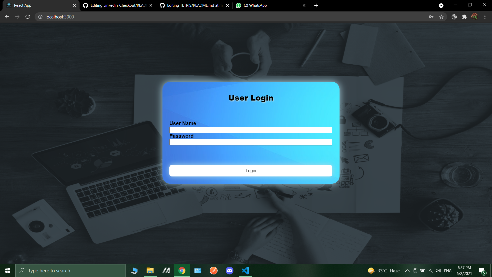
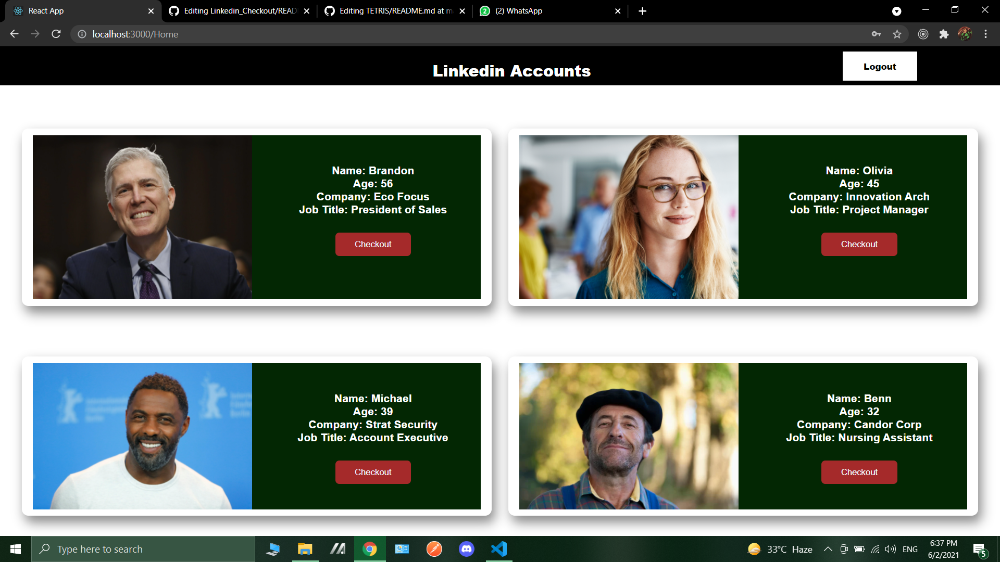
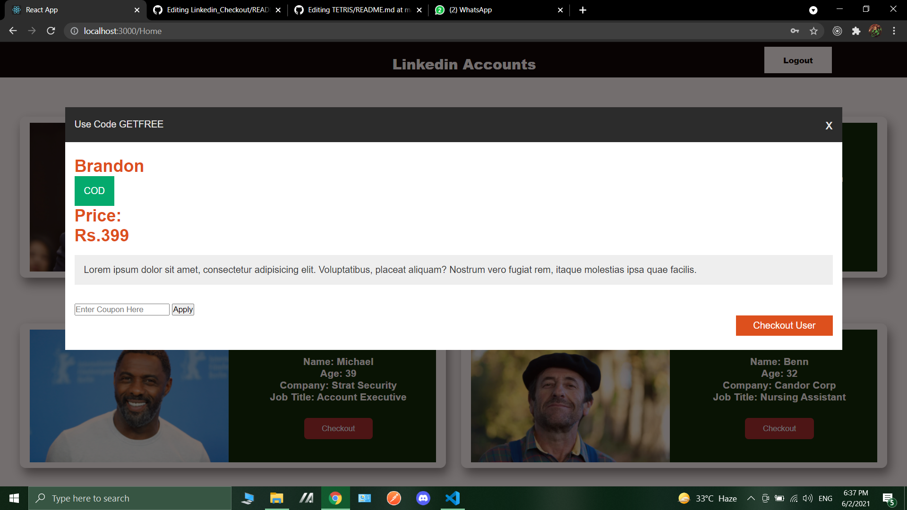
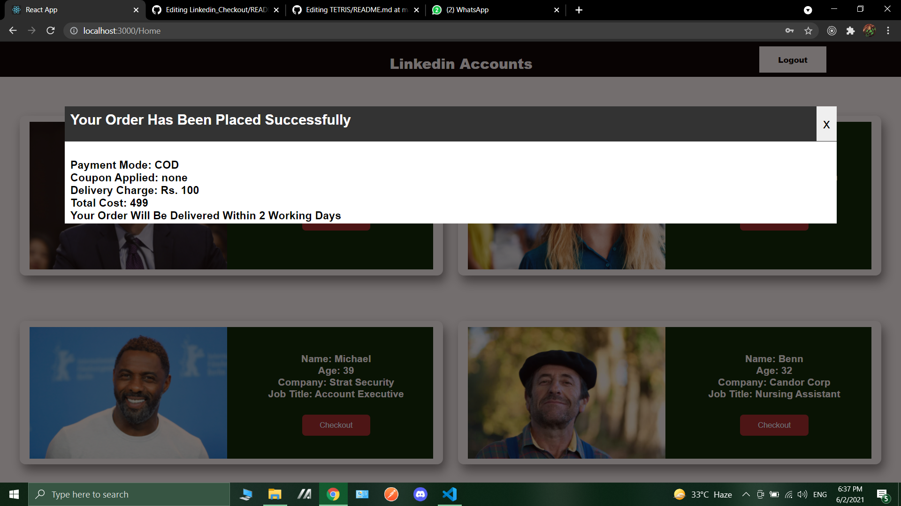

* First created basic project files using create command and also installed React-router-dom.

* Then created all the datas to be used inside the Home page.

* Made the Login Page with Authentication inside and styled it with css.

* Then on entering right username and password (Made Locally) will let us in the home page where all the linkeln accounts are present.

* After that when we get in home page we'll have the details of some accounts with a checkout button.

* Checkout button provides us with some features like coupon discount, mode of delivery and the price.

* After successfully checking out all the details will be shown to the user that is done.

